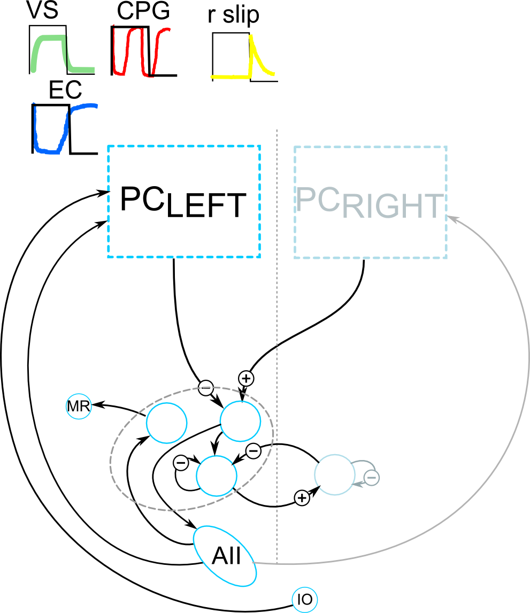

# Predictive optokinetic eye movement with a realistic computational model of the cerebellum.

This repository contains a sufficient mechanism for reproducing predictive eye velocity control known as predictive optokinetic response (OKR). Predictive OKR has been reported in goldfish in response to periodic visual stimuli. After prolonged exposure to periodic optokinetic visual stimulation, eye velocity not only increases to match the stimulus velocity (i.e., gain adaptation) but also develops predictive components both at the start (initiation) and the stop (termination) of the stimulus [1]. Namely, eye velocity starts to increase and decrease before the initiation and termination of the visual stimulus, respectively. OKR gain adaptation has been known to be caused by learning in the cerebellar cortex whose purpose is to reduce the retinal slip. In contrast, the predictive OKR components work apparently in the opposite way by momentarily increasing the retinal slip, but may contribute to reduce the retinal slip during and after changes in the visual stimulus direction. It has been demonstrated that the cerebellum is required for the acquisition of predictive OKR as cerebellectomized animals never acquire such eye velocity changes [1]. It has also been suggested that the cerebellum alone is not sufficient to acquire predictive OKR as zebrafish and medaka that share basic cerebellar neuronal architecture with goldfish did not acquire predictive OKR [2]. Presently, we first confirmed that a realistic bi-hemispherical neural network model of the cerebellum (biCNN) that we constructed previously [3] reproduced OKR gain adaptation, but did not acquire predictive OKR. Then we proposed a possible mechanism to reproduce the acquisition process of predictive OKR that consists of a central pattern generator (CPG) working in tandem with the cerebellum. In the biCNN, learning is expressed physiologically plausibly at the synapses of parallel fibers and Purkinje cells via long term potentiation and depression driven by the climbing fiber input to Purkinje cells carrying an error signal (retinal slip), whereas learning in the CGP consists of modification of inter-neuron synapses using a modified Hebbian rule. We showed that the CPG comprising two artificial neurons with outputs projecting to the input of the biCNN via mossy fibers is a sufficient mechanism to reproduce predictive OKR (both initiation and termination components) when the output of the biCNN (i.e., Purkinje cell activity) modulates the intrinsic dynamics of the CPG (oscillation's period and phase). Referring to available anatomical and physiological evidence, we propose that a CPG could be located in the vestibular nuclei some types of whose neurons project to the cerebellar cortex and also receive output of Purkinje cells as represented in the proposed framework

